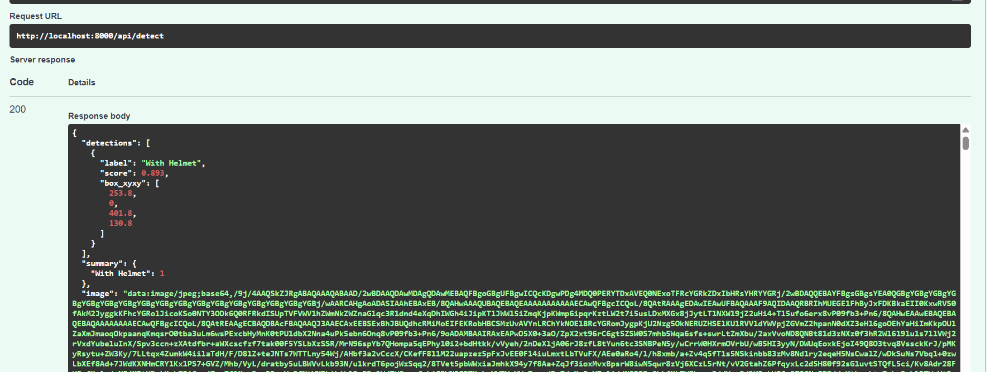
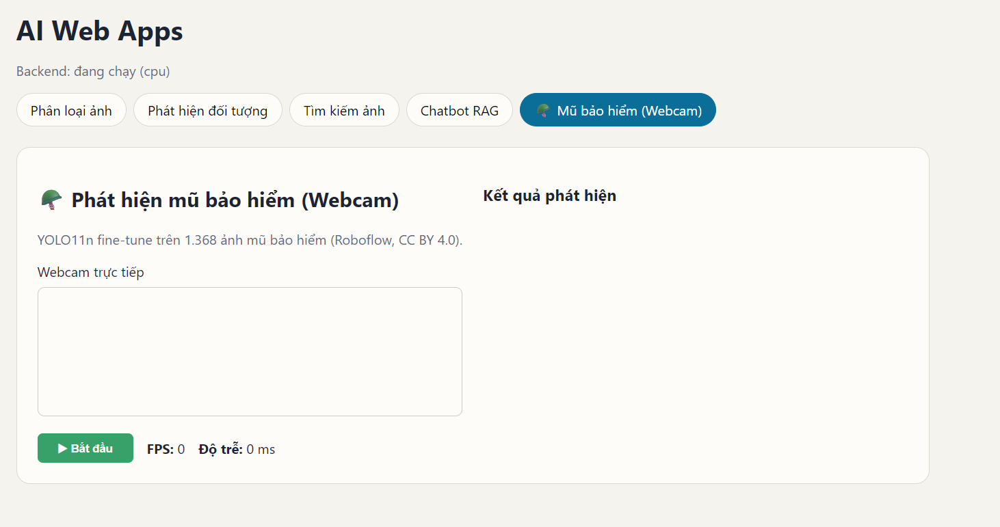
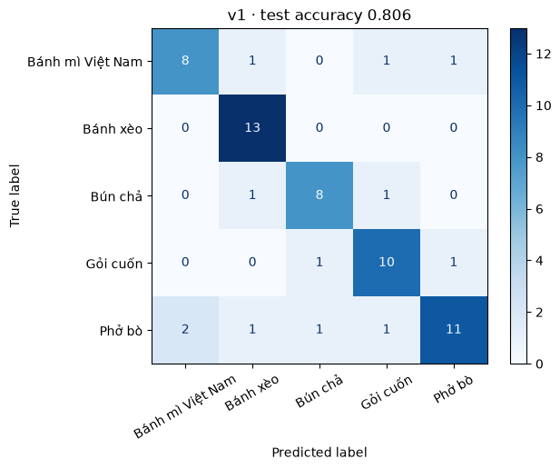
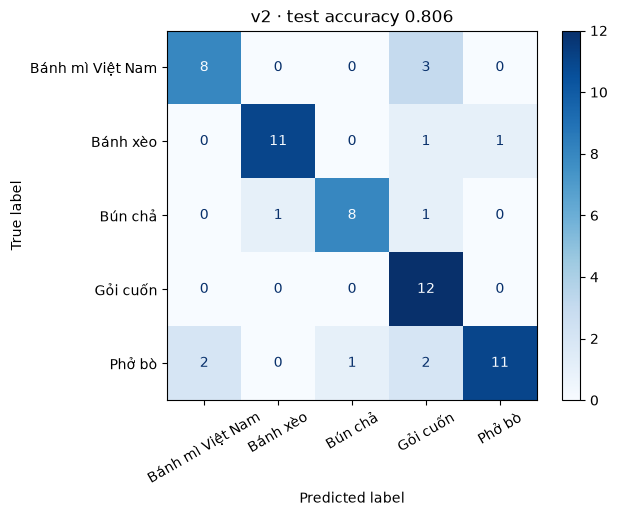

# AI Web Apps — 4 ứng dụng AI trên một trang web

Bài tập môn học phần Lập trình Web nâng cao (N05). Một backend FastAPI giữ 4 mô hình AI; hai giao diện web cùng gọi vào backend đó: React (một trang, 4 tab) và Streamlit.

| Thành viên | MSSV |
|---|---|
| (điền) | (điền) | 
| (điền) | (điền) | 

## Liên kết sản phẩm

| Mục | Link |
|---|---|
| GitHub (tag v1.0) | https://github.com/Luzji/ai-web-apps/releases/tag/v1.0 |
| Giao diện web (React, Vercel) | https://ai-web-apps.vercel.app/ (demo giao diện — để test đầy đủ cần chạy backend local/ngrok) |
| Backend API (ngrok, chạy trên laptop) | https://reapply-frozen-lumpish.ngrok-free.dev · tài liệu `/docs` · kiểm tra `/api/health` |
| Giao diện Streamlit (tùy chọn) | https://ai-web-apps-tenqchajle4ipxjyhzgukr.streamlit.app/ |
| Model card | `MODEL_CARD.md` |

### Backend API (ngrok)

🔗 Swagger UI: https://reapply-frozen-lumpish.ngrok-free.dev/docs


   ## Video demo
   xem tất cả trong folder: [Google Drive](https://drive.google.com/drive/folders/1Y546lEZmJQnrgY4xHGL2CEGeR-XwH6Kk?usp=drive_link)
## Hướng dẫn chạy local (để test đầy đủ)

Do tính năng Webcam yêu cầu camera thật và backend chạy trên máy, làm theo các bước sau để test đầy đủ:

1. **Cài đặt:**
   ```bash
   git clone https://github.com/Luzji/ai-web-apps.git
   cd ai-web-apps
   python -m venv .venv && .venv\Scripts\activate
   pip install -r requirements.txt
   cd web && npm install && cd ..


## 4 chức năng AI

| # | Chức năng | Mô hình | Dữ liệu | Chỉ số đánh giá |
|---|---|---|---|---|
| 1 | Nhận diện hình ảnh (5 lớp món ăn Việt) + giải thích Grad-CAM | ResNet-18 fine-tune | 628 ảnh món ăn Việt tự thu thập (≥ 100 ảnh/lớp) | Accuracy, F1, ma trận nhầm lẫn |
| 2 | Phát hiện đối tượng (80 lớp COCO + mũ bảo hiểm VN) | YOLO11n fine-tune | COCO128 + 1.368 ảnh mũ bảo hiểm (Roboflow, CC BY 4.0) | mAP50 0.797 · Webcam real-time ~5 FPS |
| 3 | Tìm kiếm ảnh (chữ → ảnh, ảnh → ảnh) | CLIP ViT-B/32 + FAISS | COCO128 + 500 ảnh hoa | Precision@5, Precision@10 |
| 4 | Chatbot chăm sóc khách hàng (RAG) | Qwen2.5-Instruct + MiniLM đa ngôn ngữ + FAISS | 6 tài liệu chính sách ShopLite (tiếng Việt) | Hit@1, Hit@3 |

## Kiến trúc

```
                       ┌────────────── Streamlit (cổng 8501) ──────────────┐
Trình duyệt ──────────►│                                                  ├──► FastAPI (cổng 8000) ──► core/
                       └────────── React build (phục vụ bởi FastAPI) ─────┘    /api/classify · /api/detect
                                                                               /api/search/* · /api/chat
```

`core/` chỉ chứa suy luận (không biết gì về web) → `api/` bọc thành HTTP → `streamlit_app.py` và `web/` chỉ là giao diện.

```
├── config.py               # cấu hình tập trung, ghi đè bằng biến môi trường
├── core/                   # classifier.py · detector.py · retrieval.py · llm.py · gradcam.py
├── api/main.py             # FastAPI (và phục vụ web/dist nếu đã build)
├── streamlit_app.py        # giao diện Streamlit
├── web/                    # giao diện React (Vite)
├── data/kb/                # kho tri thức chatbot (6 file Markdown)
├── train.py                # huấn luyện App 1 (v1 ResNet-18, v2 MobileNetV3) → out_v1/
├── tai_anh.py              # tải bù dữ liệu món ăn Việt (Bing + DuckDuckGo, tự dọn ảnh trùng/hỏng)
├── build_search.py         # build lại chỉ mục FAISS cho tìm kiếm ảnh
├── out_v1/                 # bằng chứng so sánh v1/v2: metrics, ONNX, ma trận nhầm lẫn
├── scripts/                # prepare.py · smoke_test.py · benchmark.py · fill_docs.py
├── tests/test_api.py       # pytest, không cần GPU / mô hình thật (chạy trong CI)
├── MODEL_CARD.md           # model card: dữ liệu, chỉ số, giới hạn, rủi ro
├── DEPLOY.md               # hướng dẫn triển khai HF Spaces / Vercel / Streamlit Cloud
└── docs/screenshots/       # ảnh giao diện nhúng trong README
```

## Grad-CAM — giải thích dự đoán trên web

Ở tab Phân loại ảnh (React và Streamlit) tick "Giải thích bằng Grad-CAM" để xem mô hình nhìn vào đâu: vùng đỏ/vàng là vùng ảnh hưởng mạnh nhất đến nhãn được giải thích (mặc định là nhãn có xác suất cao nhất; API cho chọn nhãn khác qua tham số `target`).

- Cài đặt: `core/gradcam.py` lấy đạo hàm của điểm số lớp theo bản đồ đặc trưng `layer4` (7×7) của ResNet-18, trung bình theo không gian làm trọng số kênh, ReLU, phóng lên khổ ảnh. Không huấn luyện thêm.
- Ảnh hiển thị là phần cắt giữa 224×224 mà mô hình nhìn nhận.
- Cách đọc đúng: bản đồ cho biết mô hình dựa vào đâu, không khẳng định dự đoán đúng. Với ảnh ngoài 5 lớp, bản đồ vẫn sáng vùng nào đó — xem thêm `MODEL_CARD.md`.

## Cài đặt và chạy

Cần Python 3.11+ và Node 22 (Vite 8 yêu cầu Node ≥ 20.19). Lần đầu tải khoảng 2–4 GB (dữ liệu + trọng số mô hình).

```bash
python -m venv .venv
.venv\Scripts\activate              # Windows   (macOS/Linux: source .venv/bin/activate)
pip install -r requirements-dev.txt

python scripts/prepare.py           # chạy 1 lần: tải dữ liệu, huấn luyện ResNet-18, lập chỉ mục, đo chỉ số

cd web && npm install && npm run build && cd ..
uvicorn api.main:app --port 8000    # React + API → http://localhost:8000   (Swagger: /docs)
streamlit run streamlit_app.py      # Streamlit → http://localhost:8501      (mở terminal khác)
```

- Chờ log `Application startup complete` (nạp 4 mô hình mất từ vài chục giây đến vài phút), rồi kiểm tra `http://localhost:8000/api/health` trả `ok`.
- Không có GPU: `prepare.py` tự chuyển sang chế độ nhẹ (1 epoch, 800 ảnh, LLM 0.5B). Máy yếu hoặc mạng chậm: chạy `prepare.py` trên Google Colab rồi tải thư mục `artifacts/` và `data/gallery/` về đặt vào dự án.
- Phát triển React: `cd web && npm run dev` (cổng 5173, proxy `/api` → 8000).
- Kiểm thử: `python -m pytest -q` (không cần GPU — tự chạy trong GitHub Actions mỗi lần push) và `python scripts/smoke_test.py` (cần API thật đang chạy).

## Ảnh giao diện

### React — một trang web, 4 chức năng
 
 

### Streamlit


## API

| Method | Endpoint | Đầu vào | Đầu ra |
|---|---|---|---|
| GET | `/api/health` | — | trạng thái thiết bị, mô hình nào đã nạp |
| POST | `/api/classify` | `file` (ảnh), `top_k` | `predictions`, `confident`, `latency_ms` |
| POST | `/api/classify/explain` | `file`, `top_k`, `target` (tùy chọn, tên lớp) | như `/api/classify` + `target`, `overlay` (ảnh JPEG base64 có bản đồ nhiệt Grad-CAM) |
| POST | `/api/detect` | `file`, `conf` | `detections`, `summary`, `image` (base64 đã vẽ hộp) |
| POST | `/api/search/text` | JSON `{query, k}` | `results` [{id, label, score, url}] |
| POST | `/api/search/image` | `file`, `k` | như trên |
| GET | `/api/gallery/{id}` | — | file ảnh trong kho |
| POST | `/api/chat` | JSON `{message, history}` | Server-Sent Events: `sources` → `token` … → `done` |
| POST | `/api/chat/sync` | như trên | `{answer, sources}` (không stream) |

## Biến môi trường

| Biến | Mặc định | Ý nghĩa |
|---|---|---|
| `ENABLED_MODELS` | `classifier,detector,retrieval,llm` | Mô hình được nạp (bớt đi nếu thiếu RAM) |
| `LLM_MODEL` | `Qwen/Qwen2.5-1.5B-Instruct` (GPU) / `Qwen/Qwen2.5-0.5B-Instruct` (CPU) | Mô hình sinh của chatbot |
| `EMBED_MODEL` | `sentence-transformers/paraphrase-multilingual-MiniLM-L12-v2` | Embedding cho RAG |
| `CLIP_MODEL` | `openai/clip-vit-base-patch32` | Tìm kiếm ảnh |
| `CORS_ORIGINS` | `http://localhost:5173,http://localhost:8501` | Origin được gọi API |
| `API_URL` | `http://localhost:8000` | (Streamlit) địa chỉ backend |

## Chỉ số mô hình

Số đo đặt tại `artifacts/classifier/metrics.json` (bản v0), `out_v1/compare_metrics.json` (v1/v2), `artifacts/detector/metrics.json`, `artifacts/retrieval/metrics.json` và `artifacts/rag_metrics.json`.

Ma trận nhầm lẫn bản phân loại: `artifacts/classifier/confusion_matrix_v0.png`, `out_v1/cm_v1.png`, `out_v1/cm_v2.png`. Giới hạn và rủi ro: xem `MODEL_CARD.md`.
### Ứng dụng 2 — Phát hiện đối tượng (Mũ bảo hiểm)

**Baseline:** YOLO11n pretrained trên COCO (80 lớp: người, xe, động vật…).

**Fine-tune:** huấn luyện 20 epochs trên bộ dữ liệu mũ bảo hiểm (1.368 ảnh train, 90 ảnh test, 2 lớp: With Helmet / Without Helmet, Roboflow Universe, CC BY 4.0).

| Cấu hình | Tập test | mAP50 | mAP50-95 | Precision | Recall | Ghi chú |
|---|---|---|---|---|---|---|
| YOLO11n (COCO, 80 lớp) | COCO128 | ~0.80+ | — | — | — | Baseline mặc định |
| YOLO11n fine-tune 20 epochs | 90 ảnh | **0.797** | 0.452 | 0.833 | 0.727 | Đạt ~95% hiệu suất baseline Roboflow (83.8%) |

File kết quả chi tiết: `artifacts/detector/helmet_metrics.json`

#### Biểu đồ huấn luyện

Ma trận nhầm lẫn (confusion matrix):


Đường cong Precision-Recall:


Biểu đồ F1-Confidence:


#### Demo API trên Swagger UI

Test endpoint `/api/detect` với ảnh người đội mũ bảo hiểm → trả về JSON có label "With Helmet", confidence 89.3%:



#### Tab Webcam trên React (mức nâng cao +2 điểm)

Giao diện React có tab " Mũ bảo hiểm (Webcam)" — gọi `/api/detect` mỗi 200 ms, hiển thị FPS real-time (~5 FPS trên CPU) và hộp vẽ quanh người đội/không đội mũ bảo hiểm:



**Tính năng tương tác:**
- Nút "Bắt đầu/Dừng" webcam
- Hiển thị FPS và độ trễ (ms) theo thời gian thực
- Bảng thống kê số lượng "With Helmet" / "Without Helmet" phát hiện được
- Danh sách chi tiết từng đối tượng với confidence score
## Đo hiệu năng

Chưa đo — bước C5 sẽ chạy `python scripts/benchmark.py --api <link backend>` (locust: tuần tự 1 người dùng, sau 3 lần khởi động) hoặc `hey`, rồi điền p50/p95 + RAM vào đây.

Phần cứng của backend: (điền — ví dụ "HF Spaces CPU basic, 2 vCPU, 16 GB" hoặc "laptop Windows, CPU …, RAM … GB").

## Docker (tùy chọn)

Chạy `prepare.py` trước để có `artifacts/` và `data/gallery/`, sau đó:

```bash
docker build -t ai-web-apps . && docker run -p 7860:7860 ai-web-apps   # mở http://localhost:7860
```

## Kết quả mô hình (đo một lần trên tập test)

### Ứng dụng 1 — Phân loại 5 món ăn Việt (628 ảnh = 5 lớp, ≥ 100 ảnh/lớp, seed 42)

| Cấu hình | Tập test | Test accuracy | Macro F1 | Ghi chú |
|---|---|---|---|---|
| v0 · ResNet-18, 5 epoch, CPU, dữ liệu 225 ảnh (chưa đủ ≥100/lớp) | 23 ảnh | 0.609 | 0.598 | mốc "trước" — giữ làm bằng chứng cải tiến |
| v1 · ResNet-18, 6 epoch, chia 80/10/10 phân tầng | 62 ảnh | 0.8065 | 0.8034 | checkpoint chính đang deploy · ONNX 9.5 ms · 44.9 MB |
| v2 · MobileNetV3-Small, cùng cách chia + xuất ONNX | 62 ảnh | 0.8065 | 0.8088 | ONNX 1.1 ms · 6.4 MB — ứng cử viên cho edge |

Ma trận nhầm lẫn bản v0:


Ma trận nhầm lẫn bản v1:



Ma trận nhầm lẫn bản v2:



### Ứng dụng 2 — Phát hiện đối tượng

**Baseline:** YOLO11n pretrained trên COCO (80 lớp: người, xe, động vật…).

**Fine-tune:** huấn luyện thêm 20 epochs trên bộ dữ liệu mũ bảo hiểm (1.368 ảnh train, 90 ảnh test, 2 lớp: With Helmet / Without Helmet, Roboflow Universe, CC BY 4.0).

| Cấu hình | Tập test | mAP50 | mAP50-95 | Precision | Recall |
|---|---|---|---|---|---|
| YOLO11n (COCO, 80 lớp) | COCO128 | ~0.80+ | — | — | — |
| YOLO11n fine-tune 20 epochs (mũ bảo hiểm) | 90 ảnh | **0.797** | 0.452 | 0.833 | 0.727 |

File kết quả: `artifacts/detector/helmet_metrics.json`  
Biểu đồ huấn luyện: `artifacts/detector/runs/helmet_yolo11n/`

**Mở rộng:** tab Webcam trên React gọi `/api/detect` mỗi 200 ms, hiển thị FPS real-time (~5 FPS trên CPU) và hộp vẽ quanh người đội/không đội mũ bảo hiểm.

## Công cụ AI đã sử dụng

Theo yêu cầu của giảng viên, nhóm ghi rõ công cụ AI và phiên bản:

## Công cụ AI đã sử dụng

Theo yêu cầu của giảng viên, nhóm ghi rõ công cụ AI và phiên bản:

| Công cụ | Phiên bản |
|---|---|
| Claude (Anthropic) | Claude Sonnet 5.5 |
| Qwen (Alibaba) | Qwen3.8 |

Các file `config.py`, `core/`, `api/main.py`, `streamlit_app.py`, `web/`, `tests/` và `data/kb/` được trích nguyên bản từ notebook `AI_Web_Apps_Streamlit_React.ipynb` do giảng viên cung cấp (Phenikaa Applied AI Lab). Dữ liệu: món ăn Việt tự thu thập (Bing/DuckDuckGo + tải tay), COCO128, TF Flowers (kho ảnh tìm kiếm). Mô hình nền: ResNet-18, MobileNetV3 (torchvision), YOLO11n (Ultralytics), CLIP (OpenAI), MiniLM (sentence-transformers), Qwen2.5 (Alibaba) qua Hugging Face.
